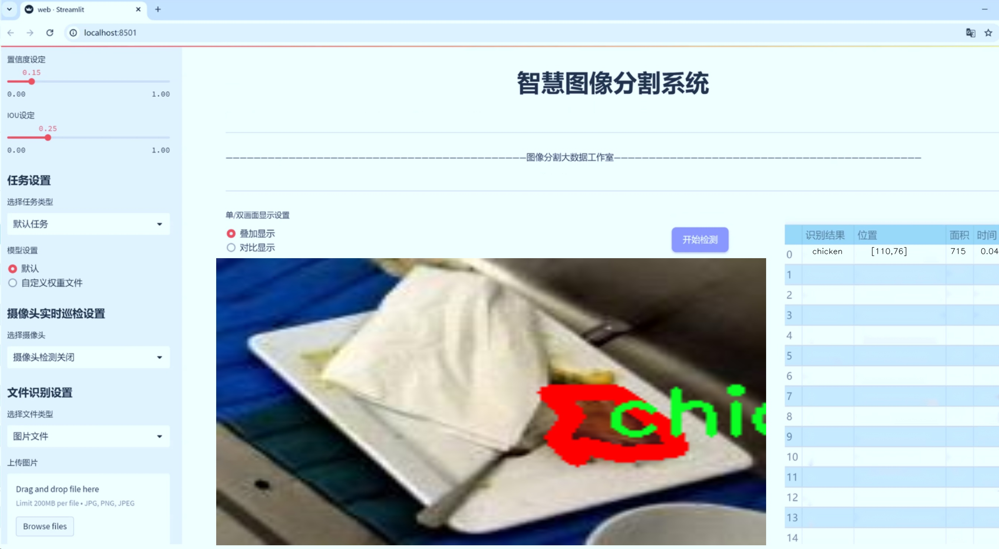
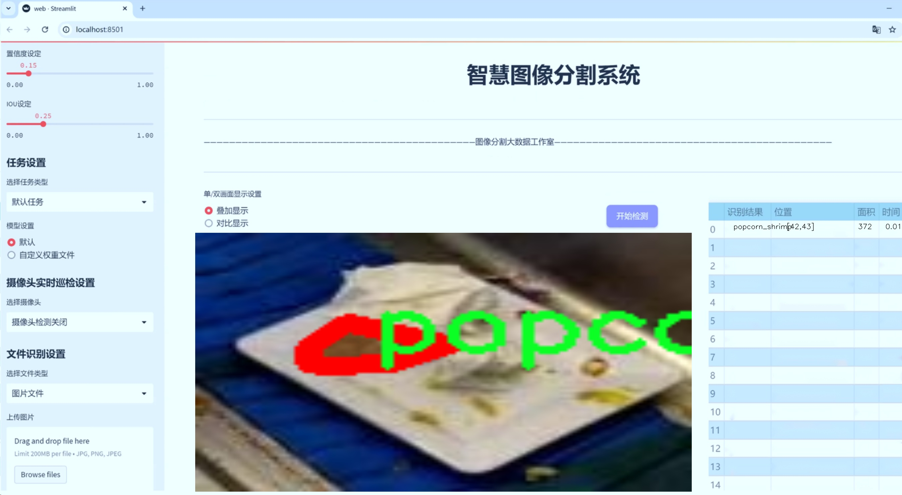
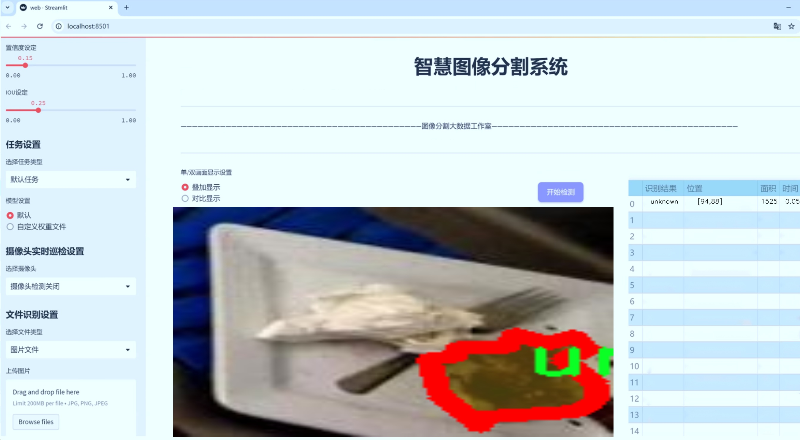
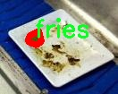

# 自助餐剩余食品识别图像分割系统源码＆数据集分享
 [yolov8-seg-C2f-FocusedLinearAttention＆yolov8-seg等50+全套改进创新点发刊_一键训练教程_Web前端展示]

### 1.研究背景与意义

项目参考[ILSVRC ImageNet Large Scale Visual Recognition Challenge](https://gitee.com/YOLOv8_YOLOv11_Segmentation_Studio/projects)

项目来源[AAAI Global Al lnnovation Contest](https://kdocs.cn/l/cszuIiCKVNis)

研究背景与意义

随着全球食品浪费问题的日益严重，如何有效识别和管理自助餐中的剩余食品成为了一个亟待解决的社会问题。根据联合国粮食及农业组织（FAO）的统计，全球每年约有三分之一的食品被浪费，这不仅造成了巨大的经济损失，也对环境造成了不可逆转的影响。因此，开发一套高效的食品识别与管理系统，能够在自助餐环境中实时监测和识别剩余食品，对于减少食品浪费、提升资源利用效率具有重要的现实意义。

在此背景下，基于改进YOLOv8的自助餐剩余食品识别图像分割系统应运而生。YOLO（You Only Look Once）系列模型因其高效的实时目标检测能力而广受欢迎，尤其是在复杂场景下的物体识别任务中表现出色。YOLOv8作为该系列的最新版本，进一步提升了模型的精度和速度，使其在处理大规模图像数据时更加高效。通过对YOLOv8进行改进，我们可以针对自助餐环境中的多样化食品进行更为精准的识别和分割，从而实现对剩余食品的有效管理。

本研究所使用的数据集“9_5_Merged”包含1000张图像，涵盖了101类食品，包括水果、肉类、主食、甜点等多种类别。这些类别的多样性为模型的训练提供了丰富的样本，使其能够在实际应用中更好地适应不同类型的食品识别需求。此外，数据集中对食品的细致分类也为后续的食品管理和资源分配提供了数据支持。例如，针对特定类型的食品（如肉类或乳制品），可以制定相应的处理和回收策略，以减少食品浪费。

通过构建基于改进YOLOv8的自助餐剩余食品识别图像分割系统，我们不仅能够实现对剩余食品的自动识别，还能够为自助餐运营者提供实时数据分析，帮助其优化食品供应链管理。通过实时监测剩余食品的种类和数量，运营者可以及时调整食品的制作和供应策略，从而有效减少食品的过量生产和浪费。

此外，本研究的成果还具有广泛的社会意义。通过提高公众对食品浪费问题的认识，促进社会各界对食品资源的珍惜与合理利用，进而推动可持续发展目标的实现。随着技术的不断进步和应用的深入，基于智能图像识别技术的食品管理系统将成为未来自助餐行业的重要发展方向，为实现食品资源的高效利用和环境保护贡献力量。

综上所述，基于改进YOLOv8的自助餐剩余食品识别图像分割系统的研究，不仅在技术层面上具有重要的创新意义，更在社会层面上为解决食品浪费问题提供了切实可行的解决方案。通过该系统的应用，我们期待能够为自助餐行业的可持续发展贡献一份力量。

### 2.图片演示







##### 注意：由于此博客编辑较早，上面“2.图片演示”和“3.视频演示”展示的系统图片或者视频可能为老版本，新版本在老版本的基础上升级如下：（实际效果以升级的新版本为准）

  （1）适配了YOLOV8的“目标检测”模型和“实例分割”模型，通过加载相应的权重（.pt）文件即可自适应加载模型。

  （2）支持“图片识别”、“视频识别”、“摄像头实时识别”三种识别模式。

  （3）支持“图片识别”、“视频识别”、“摄像头实时识别”三种识别结果保存导出，解决手动导出（容易卡顿出现爆内存）存在的问题，识别完自动保存结果并导出到tempDir中。

  （4）支持Web前端系统中的标题、背景图等自定义修改，后面提供修改教程。

  另外本项目提供训练的数据集和训练教程,暂不提供权重文件（best.pt）,需要您按照教程进行训练后实现图片演示和Web前端界面演示的效果。

### 3.视频演示

[3.1 视频演示](https://www.bilibili.com/video/BV1cPDEYDEPu/)

### 4.数据集信息展示

##### 4.1 本项目数据集详细数据（类别数＆类别名）

nc: 71
names: ['bacon', 'bagel', 'beans', 'beef', 'biscuit', 'black_beans', 'bread', 'breakfast_burrito', 'bun', 'burger', 'burger_patty', 'cereal', 'chicken', 'chicken_sausage', 'chicken_sausage_patty', 'chicken_tenders', 'cookies', 'curry', 'dessert', 'dinner_roll', 'eggplant', 'fish', 'french_toast', 'fries', 'fruit', 'grits', 'guacamole', 'hardboiled_egg', 'hot_dog', 'ice_cream', 'jalapeno_poppers', 'jalopenos', 'mac_and_cheese', 'mashed_potato', 'meatless_chicken_tenders', 'milk', 'muffin', 'naan', 'nacho', 'oatmeal', 'pancake', 'pasta', 'pickle', 'pizza', 'pizza_crust', 'popcorn_shrimp', 'potato', 'potato_skin', 'quiche', 'quinoa', 'rice', 'rice_beans', 'salad', 'salmon', 'sandwich', 'sausage', 'sausage_patty', 'scrambled_eggs', 'smoothie', 'soup', 'taco', 'tater_tots', 'toast', 'tomato', 'tortilla_chip', 'tuna_melt', 'turkey', 'unknown', 'vegetables', 'wrap', 'yogurt']


##### 4.2 本项目数据集信息介绍

数据集信息展示

在本研究中，我们使用的数据集名为“9_5_Merged”，该数据集专门用于训练改进YOLOv8-seg的自助餐剩余食品识别图像分割系统。该数据集包含71个类别，涵盖了丰富多样的食品种类，旨在提高模型对不同类型剩余食品的识别和分割能力。通过对这些类别的细致划分，我们希望能够实现更高精度的图像分割，进而优化自助餐剩余食品的管理和利用。

数据集中包含的类别包括多种常见的食品，如“bacon”（培根）、“bagel”（百吉饼）、“beans”（豆类）、“beef”（牛肉）、“biscuit”（饼干）等。这些类别不仅涵盖了主食、配菜和甜点，还包括多种类型的肉类和素食选项，确保了数据集的多样性和全面性。例如，“chicken”（鸡肉）、“fish”（鱼）、“salmon”（三文鱼）等类别代表了不同的蛋白质来源，而“vegetables”（蔬菜）和“fruit”（水果）则提供了健康饮食的选项。

此外，数据集中还包括一些特定的食品，如“breakfast_burrito”（早餐卷饼）、“mac_and_cheese”（通心粉与奶酪）、“taco”（玉米饼）等，这些都是自助餐中常见的选择。为了进一步增强模型的识别能力，数据集还包含了一些不太常见的食品，如“jalapeno_poppers”（墨西哥辣椒球）、“quiche”（法式咸派）和“tuna_melt”（金枪鱼融化三明治），这些类别的加入使得模型在处理多样化的食品时更加灵活。

值得注意的是，数据集中还设有一个“unknown”（未知）类别，以应对那些不在上述分类中的食品。这一设计使得模型在实际应用中能够更好地处理不确定性，提升其适应性和鲁棒性。

数据集的构建过程注重数据的质量和标注的准确性。每一张图像都经过严格的标注，确保每个类别的食品在图像中都能被清晰地识别和分割。这种高质量的标注不仅为模型的训练提供了坚实的基础，也为后续的评估和测试提供了可靠的数据支持。

通过使用“9_5_Merged”数据集，我们期望能够显著提升YOLOv8-seg在自助餐剩余食品识别和分割任务中的表现。该数据集的丰富性和多样性将为模型的训练提供充足的样本，帮助其学习到更为复杂的食品特征和形态。最终，我们希望通过这一系统的实现，能够有效地促进自助餐食品的管理，减少浪费，提升资源的利用效率。





### 5.全套项目环境部署视频教程（零基础手把手教学）

[5.1 环境部署教程链接（零基础手把手教学）](https://www.bilibili.com/video/BV1jG4Ve4E9t/?vd_source=bc9aec86d164b67a7004b996143742dc)


[5.2 安装Python虚拟环境创建和依赖库安装视频教程链接（零基础手把手教学）](https://www.bilibili.com/video/BV1nA4VeYEze/?vd_source=bc9aec86d164b67a7004b996143742dc)

### 6.手把手YOLOV8-seg训练视频教程（零基础小白有手就能学会）

[6.1 手把手YOLOV8-seg训练视频教程（零基础小白有手就能学会）](https://www.bilibili.com/video/BV1cA4VeYETe/?vd_source=bc9aec86d164b67a7004b996143742dc)


按照上面的训练视频教程链接加载项目提供的数据集，运行train.py即可开始训练



     Epoch   gpu_mem       box       obj       cls    labels  img_size
     1/200     0G   0.01576   0.01955  0.007536        22      1280: 100%|██████████| 849/849 [14:42<00:00,  1.04s/it]
               Class     Images     Labels          P          R     mAP@.5 mAP@.5:.95: 100%|██████████| 213/213 [01:14<00:00,  2.87it/s]
                 all       3395      17314      0.994      0.957      0.0957      0.0843

     Epoch   gpu_mem       box       obj       cls    labels  img_size
     2/200     0G   0.01578   0.01923  0.007006        22      1280: 100%|██████████| 849/849 [14:44<00:00,  1.04s/it]
               Class     Images     Labels          P          R     mAP@.5 mAP@.5:.95: 100%|██████████| 213/213 [01:12<00:00,  2.95it/s]
                 all       3395      17314      0.996      0.956      0.0957      0.0845

     Epoch   gpu_mem       box       obj       cls    labels  img_size
     3/200     0G   0.01561    0.0191  0.006895        27      1280: 100%|██████████| 849/849 [10:56<00:00,  1.29it/s]
               Class     Images     Labels          P          R     mAP@.5 mAP@.5:.95: 100%|███████   | 187/213 [00:52<00:00,  4.04it/s]
                 all       3395      17314      0.996      0.957      0.0957      0.0845


### 7.50+种全套YOLOV8-seg创新点代码加载调参视频教程（一键加载写好的改进模型的配置文件）

[7.1 50+种全套YOLOV8-seg创新点代码加载调参视频教程（一键加载写好的改进模型的配置文件）](https://www.bilibili.com/video/BV1Hw4VePEXv/?vd_source=bc9aec86d164b67a7004b996143742dc)

### 8.YOLOV8-seg图像分割算法原理

原始YOLOv8-seg算法原理

YOLOv8-seg算法是由Ultralytics团队在YOLOv5的基础上发展而来的最新目标检测与分割模型，旨在通过引入一系列创新的结构和技术，提升目标检测的精度和速度。该算法于2023年1月正式提出，标志着YOLO系列模型在目标检测领域的又一次重要进步。YOLOv8-seg不仅延续了YOLO系列的高效性，还在特征提取、特征融合和输出层设计等方面进行了重要的改进，特别是在图像分割任务中的应用，使其在复杂场景下的表现更加出色。

在YOLOv8-seg的网络结构中，输入层首先接收经过预处理的图像，图像的尺寸被统一调整为640x640的RGB格式。YOLOv8-seg在数据增强方面采取了更为谨慎的策略，尤其是在训练的最后10个epoch中停止使用Mosaic数据增强。这一改变是基于对数据真实分布的考量，旨在避免模型学习到不良信息，从而提升模型的泛化能力和鲁棒性。

YOLOv8-seg的主干网络采用了CSPDarknet结构，但将传统的C3模块替换为C2f模块。C2f模块的设计灵感来源于YOLOv7中的ELAN结构，通过引入更多的跳层连接，增强了梯度流的传递，使得网络在深层次的特征提取中表现得更加高效。C2f模块由多个卷积块和Bottleneck层组成，这种设计不仅减轻了模型的计算负担，还有效提升了特征提取的丰富性。此外，YOLOv8-seg保留了SPPF模块，进一步提升了特征提取的效率，同时降低了执行时间。

在特征融合阶段，YOLOv8-seg采用了PAN-FPN结构，通过自下而上的方式将高层特征与中层和浅层特征进行融合。这一过程不仅确保了不同尺度特征的有效整合，还增强了模型对目标的识别能力。通过对特征图的逐层融合，YOLOv8-seg能够在保持高层语义信息的同时，获取细节特征，从而在复杂场景中实现更精确的目标检测和分割。

YOLOv8-seg的头部网络设计采用了解耦头的思路，将分类和回归任务分为两个并行的分支。这样的设计使得模型在处理分类和定位任务时，能够更专注于各自的特征提取，从而提高了收敛速度和预测精度。具体而言，分类分支侧重于分析特征图中提取到的特征与已有类别的相似性，而定位分支则更关注边界框与真实框之间的关系。这种解耦设计在提高检测精度的同时，也优化了模型的推理速度。

在损失函数的设计上，YOLOv8-seg引入了VFLLoss和DFLLoss+CIoULoss的组合，以更好地处理分类和定位任务中的损失计算。通过引入高次幂乘积作为任务对齐的指标，YOLOv8-seg能够在分类和定位损失函数中同时考虑分类分数和IOU，从而实现更优的模型性能。

YOLOv8-seg在目标检测的结果上表现出色，其在COCO数据集上的mAP（mean Average Precision）指标显示出较高的准确性。与其他YOLO系列模型相比，YOLOv8-seg在相同尺寸下的模型参数并未显著增加，但其精度却得到了显著提升。此外，YOLOv8-seg在推理速度上也表现优异，使其在实时性要求较高的应用场景中具备了更强的竞争力。

总的来说，YOLOv8-seg算法通过一系列创新的设计和改进，成功地提升了目标检测和分割的性能，特别是在复杂场景下的应用潜力。其轻量化的设计和高效的特征提取能力，使得YOLOv8-seg在实际应用中具备了极大的灵活性和实用性。随着对YOLOv8-seg算法的深入研究和应用，未来在智能监控、自动驾驶、机器人视觉等领域，YOLOv8-seg都有望发挥更大的作用。


### 9.系统功能展示（检测对象为举例，实际内容以本项目数据集为准）

图9.1.系统支持检测结果表格显示

  图9.2.系统支持置信度和IOU阈值手动调节

  图9.3.系统支持自定义加载权重文件best.pt(需要你通过步骤5中训练获得)

  图9.4.系统支持摄像头实时识别

  图9.5.系统支持图片识别

  图9.6.系统支持视频识别

  图9.7.系统支持识别结果文件自动保存

  图9.8.系统支持Excel导出检测结果数据


### 10.50+种全套YOLOV8-seg创新点原理讲解（非科班也可以轻松写刊发刊，V11版本正在科研待更新）

#### 10.1 由于篇幅限制，每个创新点的具体原理讲解就不一一展开，具体见下列网址中的创新点对应子项目的技术原理博客网址【Blog】：


[10.1 50+种全套YOLOV8-seg创新点原理讲解链接](https://gitee.com/qunmasj/good)

#### 10.2 部分改进模块原理讲解(完整的改进原理见上图和技术博客链接)【如果此小节的图加载失败可以通过CSDN或者Github搜索该博客的标题访问原始博客，原始博客图片显示正常】

### YOLOv8模型
YOLOv8模型由Ultralytics团队在YOLOv5模型的基础上，吸收了近两年半来经过实际验证的各种改进，于2023年1月提出。与之前的一些YOLO 系列模型想类似，YOLOv8模型也有多种尺寸，下面以YOLOv8n为例，分析 YOLOv8模型的结构和改进点。YOLOv8模型网络结构如
输入图片的部分，由于发现Mosaic数据增强尽管这有助于提升模型的鲁棒性和泛化性，但是，在一定程度上，也会破坏数据的真实分布，使得模型学习到一些不好的信息。所以YOLOv8模型在训练中的最后10个epoch 停止使用Mosaic数据增强。


在网络结构上，首先主干网络的改变不大，主要是将C3模块替换为了C2f模块，该模块的结构在上图中已示出。C2f模块在C3模块的思路基础上，引入了YOLOv7中 ELAN的思路，引入了更多的跳层连接，这有助于该模块获得更丰富的梯度流信息，而且模型的轻量化得到了保证。依然保留了SPPF，效果不变的同时减少了该模块的执行时间。
在颈部网络中，也是将所有的C3模块更改为C2f模块，同时删除了两处上采样之前的卷积连接层。
在头部网络中，采用了YOLOX中使用的解耦头的思路，两条并行的分支分别提取类别和位置特征。由于分类任务更注重于分析特征图中提取到的特征与已输入图片的部分，由于发现 Mosaic数据增强尽管这有助于提升模型的鲁棒性和泛化性，但是，在一定程度上，也会破坏数据的真实分布，使得模型学习到一些不好的信息。所以YOLOv8模型在训练中的最后10个epoch停止使用Mosaic数据增强。
在网络结构上，首先主干网络的改变不大，主要是将C3模块替换为了C2f模块，该模块的结构在上图中已示出。C2f模块在C3模块的思路基础上，引入了YOLOv7中ELAN的思路，引入了更多的跳层连接，这有助于该模块获得更丰富的梯度流信息，而且模型的轻量化得到了保证。依然保留了SPPF，效果不变的同时减少了该模块的执行时间。
在颈部网络中，也是将所有的C3模块更改为C2f模块，同时删除了两处上采样之前的卷积连接层。
在头部网络中，采用了YOLOX中使用的解耦头的思路，两条并行的分支分别提取类别和位置特征。由于分类任务更注重于分析特征图中提取到的特征与已有类别中的哪一种更为相似，而定位任务更关注边界框与真值框的位置关系，并据此对边界框的坐标进行调整。侧重点的不同使得在使用两个检测头时收敛的速度和预测的精度有所提高。而且使用了无锚框结构，直接预测目标的中心，并使用TAL (Task Alignment Learning，任务对齐学习）来区分正负样本，引入了分类分数和IOU的高次幂乘积作为衡量任务对齐程度的指标，认为同时拥有好的定位和分类评价的在分类和定位损失函数中也引入了这项指标。
在模型的检测结果上，YOLOv8模型也取得了较好的成果，图为官方在coCO数据集上 YOLOv8模型的模型尺寸大小和检测的mAP50-95对比图。mAP50-95指的是IOU的值从50%取到95%，步长为5%，然后算在这些IOU下的mAP的均值。图的 a）图展示了YOLOv8在同尺寸下模型中参数没有较大增加的前提下取得了比其他模型更好的精度，图2-17的b)图展示了YOLOv8比其他YOLO系列模型在同尺寸时，推理速度更快且精度没有太大下降。


### 视觉transformer(ViT)简介
视觉transformer(ViT)最近在各种计算机视觉任务中证明了巨大的成功，并受到了相当多的关注。与卷积神经网络(CNNs)相比，ViT具有更强的全局信息捕获能力和远程交互能力，表现出优于CNNs的准确性，特别是在扩大训练数据大小和模型大小时[An image is worth 16x16 words: Transformers for image recognition at scale,Coatnet]。

尽管ViT在低分辨率和高计算领域取得了巨大成功，但在高分辨率和低计算场景下，ViT仍不如cnn。例如，下图(左)比较了COCO数据集上当前基于cnn和基于vit的一级检测器。基于vit的检测器(160G mac)和基于cnn的检测器(6G mac)之间的效率差距超过一个数量级。这阻碍了在边缘设备的实时高分辨率视觉应用程序上部署ViT。


左图:现有的基于vit的一级检测器在实时目标检测方面仍然不如当前基于cnn的一级检测器，需要的计算量多出一个数量级。本文引入了第一个基于vit的实时对象检测器来弥补这一差距。在COCO上，efficientvit的AP比efficientdet高3.8，而mac较低。与YoloX相比，efficient ViT节省67.2%的计算成本，同时提供更高的AP。

中:随着输入分辨率的增加，计算成本呈二次增长，无法有效处理高分辨率的视觉应用。

右图:高分辨率对图像分割很重要。当输入分辨率从1024x2048降低到512x1024时，MobileNetV2的mIoU减少12% (8.5 mIoU)。在不提高分辨率的情况下，只提高模型尺寸是无法缩小性能差距的。

ViT的根本计算瓶颈是softmax注意模块，其计算成本随输入分辨率的增加呈二次增长。例如，如上图(中)所示，随着输入分辨率的增加，vit- small[Pytorch image models. https://github.com/rwightman/ pytorch-image-models]的计算成本迅速显著大于ResNet-152的计算成本。

解决这个问题的一个直接方法是降低输入分辨率。然而，高分辨率的视觉识别在许多现实世界的计算机视觉应用中是必不可少的，如自动驾驶，医疗图像处理等。当输入分辨率降低时，图像中的小物体和精细细节会消失，导致目标检测和语义分割性能显著下降。

上图(右)显示了在cityscape数据集上不同输入分辨率和宽度乘法器下MobileNetV2的性能。例如，将输入分辨率从1024x2048降低到512x1024会使cityscape的性能降低12% (8.5 mIoU)。即使是3.6倍高的mac，只放大模型尺寸而不增加分辨率也无法弥补这一性能损失。

除了降低分辨率外，另一种代表性的方法是限制softmax注意，方法是将其范围限制在固定大小的局部窗口内[Swin transformer,Swin transformer v2]或降低键/值张量的维数[Pyramid vision transformer,Segformer]。然而，它损害了ViT的非局部注意能力，降低了全局接受域(ViT最重要的优点)，使得ViT与大内核cnn的区别更小[A convnet for the 2020s,Scaling up your kernels to 31x31: Revisiting large kernel design in cnns,Lite pose: Efficient architecture design for 2d human pose estimation]。

本文介绍了一个有效的ViT体系结构，以解决这些挑战。发现没有必要坚持softmax注意力。本文建议用线性注意[Transformers are rnns: Fast autoregressive transformers with linear attention]代替softmax注意。

线性注意的关键好处是，它保持了完整的n 2 n^2n 2
 注意映射，就像softmax注意。同时，它利用矩阵乘法的联想特性，避免显式计算完整的注意映射，同时保持相同的功能。因此，它保持了softmax注意力的全局特征提取能力，且计算复杂度仅为线性。线性注意的另一个关键优点是它避免了softmax，这使得它在移动设备上更有效(下图左)。


左图:线性注意比类似mac下的softmax注意快3.3-4.5倍，这是因为去掉了硬件效率不高的softmax功能。延迟是在Qualcomm Snapdragon 855 CPU和TensorFlow-Lite上测量的。本文增加线性注意的头部数量，以确保它具有与softmax注意相似的mac。

中:然而，如果没有softmax注意中使用的非线性注意评分归一化，线性注意无法有效集中其注意分布，削弱了其局部特征提取能力。后文提供了可视化。

右图:本文用深度卷积增强线性注意，以解决线性注意的局限性。深度卷积可以有效地捕捉局部特征，而线性注意可以专注于捕捉全局信息。增强的线性注意在保持线性注意的效率和简单性的同时，表现出在各种视觉任务上的强大表现(图4)。

然而，直接应用线性注意也有缺点。以往的研究表明线性注意和softmax注意之间存在显著的性能差距(下图中间)。


左:高通骁龙855上的精度和延迟权衡。效率vit比效率网快3倍，精度更高。中:ImageNet上softmax注意与线性注意的比较。在相同的计算条件下，本文观察到softmax注意与线性注意之间存在显著的精度差距。而深度卷积增强模型后，线性注意的精度有明显提高。

相比之下，softmax注意的精度变化不大。在相同MAC约束下，增强线性注意比增强软最大注意提高了0.3%的精度。右图:与增强的softmax注意相比，增强的线性注意硬件效率更高，随着分辨率的增加，延迟增长更慢。

深入研究线性注意和softmax注意的详细公式，一个关键的区别是线性注意缺乏非线性注意评分归一化方案。这使得线性注意无法有效地将注意力分布集中在局部模式产生的高注意分数上，从而削弱了其局部特征提取能力。

本文认为这是线性注意的主要限制，使其性能不如softmax注意。本文提出了一个简单而有效的解决方案来解决这一限制，同时保持线性注意在低复杂度和低硬件延迟方面的优势。具体来说，本文建议通过在每个FFN层中插入额外的深度卷积来增强线性注意。因此，本文不需要依赖线性注意进行局部特征提取，避免了线性注意在捕捉局部特征方面的不足，并利用了线性注意在捕捉全局特征方面的优势。

本文广泛评估了efficient vit在低计算预算下对各种视觉任务的有效性，包括COCO对象检测、城市景观语义分割和ImageNet分类。本文想要突出高效的主干设计，所以没有包括任何正交的附加技术(例如，知识蒸馏，神经架构搜索)。尽管如此，在COCO val2017上，efficientvit的AP比efficientdet - d1高2.4倍，同时节省27.9%的计算成本。在cityscape上，efficientvit提供了比SegFormer高2.5个mIoU，同时降低了69.6%的计算成本。在ImageNet上，efficientvit在584M mac上实现了79.7%的top1精度，优于efficientnet - b1的精度，同时节省了16.6%的计算成本。

与现有的以减少参数大小或mac为目标的移动ViT模型[Mobile-former,Mobilevit,NASVit]不同，本文的目标是减少移动设备上的延迟。本文的模型不涉及复杂的依赖或硬件低效操作。因此，本文减少的计算成本可以很容易地转化为移动设备上的延迟减少。

在高通骁龙855 CPU上，efficient vit运行速度比efficientnet快3倍，同时提供更高的ImageNet精度。本文的代码和预训练的模型将在出版后向公众发布。

### Efficient Vision Transformer.
提高ViT的效率对于在资源受限的边缘平台上部署ViT至关重要，如手机、物联网设备等。尽管ViT在高计算区域提供了令人印象深刻的性能，但在针对低计算区域时，它通常不如以前高效的cnn[Efficientnet, mobilenetv3,Once for all: Train one network and specialize it for efficient deployment]。为了缩小差距，MobileViT建议结合CNN和ViT的长处，使用transformer将卷积中的局部处理替换为全局处理。MobileFormer提出了在MobileNet和Transformer之间建立双向桥以实现特征融合的并行化。NASViT提出利用神经架构搜索来搜索高效的ViT架构。

这些模型在ImageNet上提供了极具竞争力的准确性和效率的权衡。然而，它们并不适合高分辨率的视觉任务，因为它们仍然依赖于softmax注意力。


在本节中，本文首先回顾了自然语言处理中的线性注意，并讨论了它的优缺点。接下来，本文介绍了一个简单而有效的解决方案来克服线性注意的局限性。最后，给出了efficient vit的详细架构。

 为可学习投影矩阵。Oi表示矩阵O的第i行。Sim(·，·)为相似度函数。

虽然softmax注意力在视觉和NLP方面非常成功，但它并不是唯一的选择。例如，线性注意提出了如下相似度函数:


其中，φ(·)为核函数。在本工作中，本文选择了ReLU作为内核函数，因为它对硬件来说是友好的。当Sim(Q, K) = φ(Q)φ(K)T时，式(1)可改写为:


线性注意的一个关键优点是，它允许利用矩阵乘法的结合律，在不改变功能的情况下，将计算复杂度从二次型降低到线性型:


除了线性复杂度之外，线性注意的另一个关键优点是它不涉及注意模块中的softmax。Softmax在硬件上效率非常低。避免它可以显著减少延迟。例如，下图(左)显示了softmax注意和线性注意之间的延迟比较。在类似的mac上，线性注意力比移动设备上的softmax注意力要快得多。


#### EfficientViT
Enhancing Linear Attention with Depthwise Convolution

虽然线性注意在计算复杂度和硬件延迟方面优于softmax注意，但线性注意也有局限性。以往的研究[\[Luna: Linear unified nested attention,Random feature attention,Combiner: Full attention transformer with sparse computation cost,cosformer: Rethinking softmax in attention\]](https://afdian.net/item/602b9612927111ee9ec55254001e7c00)表明，在NLP中线性注意和softmax注意之间通常存在显著的性能差距。对于视觉任务，之前的研究[Visual correspondence hallucination,Quadtree attention for vision transformers]也表明线性注意不如softmax注意。在本文的实验中，本文也有类似的观察结果(图中)。


本文对这一假设提出了质疑，认为线性注意的低劣性能主要是由于局部特征提取能力的丧失。如果没有在softmax注意中使用的非线性评分归一化，线性注意很难像softmax注意那样集中其注意分布。下图(中间)提供了这种差异的示例。


在相同的原始注意力得分下，使用softmax比不使用softmax更能集中注意力。因此，线性注意不能有效地聚焦于局部模式产生的高注意分数(下图)，削弱了其局部特征提取能力。


注意图的可视化显示了线性注意的局限性。通过非线性注意归一化，softmax注意可以产生清晰的注意分布，如中间行所示。相比之下，线性注意的分布相对平滑，使得线性注意在捕捉局部细节方面的能力较弱，造成了显著的精度损失。本文通过深度卷积增强线性注意来解决这一限制，并有效提高了准确性。

介绍了一个简单而有效的解决方案来解决这个限制。本文的想法是用卷积增强线性注意，这在局部特征提取中是非常有效的。这样，本文就不需要依赖于线性注意来捕捉局部特征，而可以专注于全局特征提取。具体来说，为了保持线性注意的效率和简单性，本文建议在每个FFN层中插入一个深度卷积，这样计算开销很小，同时极大地提高了线性注意的局部特征提取能力。

#### Building Block

下图(右)展示了增强线性注意的详细架构，它包括一个线性注意层和一个FFN层，在FFN的中间插入深度卷积。


与之前的方法[Swin transformer,Coatnet]不同，本文在efficientvit中没有使用相对位置偏差。相对位置偏差虽然可以改善模型的性能，但它使模型容易受到分辨率变化[Segformer]的影响。多分辨率训练或新分辨率下的测试在检测和分割中很常见。去除相对位置偏差使高效率vit对输入分辨率更加灵活。

与之前低计算CNNs[Mobilenetv2,mobilenetv3]的设计不同，本文为下采样块添加了额外的下采样快捷方式。每个下采样快捷方式由一个平均池和一个1x1卷积组成。在本文的实验中，这些额外的下采样快捷方式可以稳定训练效率，提高性能。

#### Macro Architecture

下图说明了efficientvit的宏观体系结构。它由输入 stem 和4级组成。最近的研究[Coatnet,Levit,Early convolutions help transformers see better]表明在早期阶段使用卷积对ViT更好。本文遵循这个设计，在第三阶段开始使用增强的线性注意。


EfficientViT宏观架构。本文从第三阶段开始使用增强的线性注意。P2、P3和P4形成了一个金字塔特征图，用于检测和分割。P4用于分类。

为了突出高效的主干本身，本文对MBConv和FFN使用相同的扩展比e (e = 4)保持超参数简单，对所有深度卷积使用相同的内核大小k(除了输入stem)，对所有层使用相同的激活函数(hard swish)。

P2、P3和P4表示阶段2、3和4的输出，形成了特征图的金字塔。本文按照惯例将P2、P3和P4送至检测头。本文使用Yolov8进行检测。为了分割，本文融合了P2和P4。融合特征被馈送到一个轻量级头，包括几个卷积层，遵循Fast-SCNN。为了分类，本文将P4输入到轻量级头部，与MobileNetV3相同。


### 11.项目核心源码讲解（再也不用担心看不懂代码逻辑）

#### 11.1 ultralytics\data\converter.py

以下是经过简化和注释的核心代码部分，主要包括 COCO 数据集的转换功能以及 DOTA 数据集的转换功能。代码中去掉了一些不必要的细节，保留了最核心的逻辑，并进行了详细的中文注释。

```python
import json
from collections import defaultdict
from pathlib import Path
import numpy as np
from ultralytics.utils import TQDM, LOGGER, increment_path

def coco91_to_coco80_class():
    """
    将 COCO 数据集的 91 类别 ID 转换为 80 类别 ID。
    
    返回:
        list: 91 类别 ID 的列表，索引表示 80 类别 ID，值为对应的 91 类别 ID。
    """
    return [
        0, 1, 2, 3, 4, 5, 6, 7, 8, 9, 10, None, 11, 12, 13, 14, 15, 16, 17, 18, 19, 20, 
        21, 22, 23, None, 24, 25, None, None, 26, 27, 28, 29, 30, 31, 32, 33, 34, 35, 
        36, 37, 38, 39, None, 40, 41, 42, 43, 44, 45, 46, 47, 48, 49, 50, 51, 52, 53, 
        54, 55, 56, 57, 58, 59, None, 60, None, None, 61, None, 62, 63, 64, 65, 66, 
        67, 68, 69, 70, 71, 72, None, 73, 74, 75, 76, 77, 78, 79, None
    ]

def convert_coco(labels_dir='../coco/annotations/', save_dir='coco_converted/', cls91to80=True):
    """
    将 COCO 数据集的标注转换为 YOLO 格式的标注。

    参数:
        labels_dir (str): COCO 数据集标注文件的目录路径。
        save_dir (str): 保存转换后结果的目录路径。
        cls91to80 (bool): 是否将 91 类别 ID 映射到 80 类别 ID。
    """
    # 创建保存目录
    save_dir = increment_path(save_dir)  # 如果目录已存在则递增
    for p in save_dir / 'labels', save_dir / 'images':
        p.mkdir(parents=True, exist_ok=True)  # 创建目录

    # 获取 COCO 80 类别映射
    coco80 = coco91_to_coco80_class()

    # 导入 JSON 文件并处理
    for json_file in sorted(Path(labels_dir).resolve().glob('*.json')):
        fn = Path(save_dir) / 'labels' / json_file.stem.replace('instances_', '')  # 生成文件夹名称
        fn.mkdir(parents=True, exist_ok=True)
        with open(json_file) as f:
            data = json.load(f)

        # 创建图像字典
        images = {f'{x["id"]:d}': x for x in data['images']}
        # 创建图像-标注字典
        imgToAnns = defaultdict(list)
        for ann in data['annotations']:
            imgToAnns[ann['image_id']].append(ann)

        # 写入标注文件
        for img_id, anns in TQDM(imgToAnns.items(), desc=f'Annotations {json_file}'):
            img = images[f'{img_id:d}']
            h, w, f = img['height'], img['width'], img['file_name']

            bboxes = []  # 存储边界框
            for ann in anns:
                if ann['iscrowd']:
                    continue  # 跳过人群标注
                # COCO 的边界框格式为 [左上角 x, 左上角 y, 宽度, 高度]
                box = np.array(ann['bbox'], dtype=np.float64)
                box[:2] += box[2:] / 2  # 转换为中心点坐标
                box[[0, 2]] /= w  # 归一化 x
                box[[1, 3]] /= h  # 归一化 y
                if box[2] <= 0 or box[3] <= 0:  # 如果宽度或高度小于等于 0
                    continue

                cls = coco80[ann['category_id'] - 1] if cls91to80 else ann['category_id'] - 1  # 类别
                box = [cls] + box.tolist()  # 将类别和边界框合并
                if box not in bboxes:
                    bboxes.append(box)

            # 写入文件
            with open((fn / f).with_suffix('.txt'), 'a') as file:
                for bbox in bboxes:
                    file.write(('%g ' * len(bbox)).rstrip() % bbox + '\n')

    LOGGER.info(f'COCO 数据成功转换。\n结果保存到 {save_dir.resolve()}')

def convert_dota_to_yolo_obb(dota_root_path: str):
    """
    将 DOTA 数据集的标注转换为 YOLO OBB（定向边界框）格式。

    参数:
        dota_root_path (str): DOTA 数据集的根目录路径。
    """
    dota_root_path = Path(dota_root_path)

    # 类别名称到索引的映射
    class_mapping = {
        'plane': 0, 'ship': 1, 'storage-tank': 2, 'baseball-diamond': 3,
        'tennis-court': 4, 'basketball-court': 5, 'ground-track-field': 6,
        'harbor': 7, 'bridge': 8, 'large-vehicle': 9, 'small-vehicle': 10,
        'helicopter': 11, 'roundabout': 12, 'soccer ball-field': 13,
        'swimming-pool': 14, 'container-crane': 15, 'airport': 16, 'helipad': 17
    }

    def convert_label(image_name, image_width, image_height, orig_label_dir, save_dir):
        """将单个图像的 DOTA 标注转换为 YOLO OBB 格式并保存。"""
        orig_label_path = orig_label_dir / f'{image_name}.txt'
        save_path = save_dir / f'{image_name}.txt'

        with orig_label_path.open('r') as f, save_path.open('w') as g:
            lines = f.readlines()
            for line in lines:
                parts = line.strip().split()
                if len(parts) < 9:
                    continue  # 跳过无效行
                class_name = parts[8]
                class_idx = class_mapping[class_name]  # 获取类别索引
                coords = [float(p) for p in parts[:8]]  # 获取坐标
                # 归一化坐标
                normalized_coords = [coords[i] / image_width if i % 2 == 0 else coords[i] / image_height for i in range(8)]
                formatted_coords = ['{:.6g}'.format(coord) for coord in normalized_coords]
                g.write(f"{class_idx} {' '.join(formatted_coords)}\n")  # 写入文件

    for phase in ['train', 'val']:
        image_dir = dota_root_path / 'images' / phase
        orig_label_dir = dota_root_path / 'labels' / f'{phase}_original'
        save_dir = dota_root_path / 'labels' / phase

        save_dir.mkdir(parents=True, exist_ok=True)  # 创建保存目录

        image_paths = list(image_dir.iterdir())
        for image_path in TQDM(image_paths, desc=f'Processing {phase} images'):
            if image_path.suffix != '.png':
                continue  # 只处理 PNG 格式的图像
            image_name_without_ext = image_path.stem
            img = cv2.imread(str(image_path))
            h, w = img.shape[:2]
            convert_label(image_name_without_ext, w, h, orig_label_dir, save_dir)  # 转换标注

```

### 主要功能说明：
1. **coco91_to_coco80_class**: 将 COCO 数据集的 91 类别 ID 转换为 80 类别 ID。
2. **convert_coco**: 将 COCO 数据集的标注转换为 YOLO 格式的标注，支持选择是否映射类别 ID。
3. **convert_dota_to_yolo_obb**: 将 DOTA 数据集的标注转换为 YOLO OBB 格式，处理训练和验证数据。

以上代码为核心功能，去除了多余的细节，方便理解和使用。

这个文件是一个用于将COCO数据集的标注转换为YOLO格式的Python脚本，主要用于计算机视觉领域的目标检测任务。文件中包含多个函数，每个函数负责不同的功能，下面是对这些函数及其作用的详细说明。

首先，文件导入了一些必要的库，包括`json`、`defaultdict`、`Path`、`cv2`和`numpy`，以及一些来自`ultralytics`库的工具函数。接着，定义了两个函数`coco91_to_coco80_class`和`coco80_to_coco91_class`，它们分别用于将COCO数据集中91个类别的ID转换为80个类别的ID，以及反向转换。这两个函数返回一个列表，其中索引表示80类的ID，值表示对应的91类ID。

接下来是`convert_coco`函数，这是该文件的核心功能之一。它将COCO数据集的标注转换为YOLO格式。函数接收多个参数，包括标注文件的目录、保存结果的目录、是否使用分割掩码、是否使用关键点标注以及是否将91类ID映射到80类ID。函数首先创建保存结果的目录，并根据需要生成相应的子目录。

然后，函数会读取指定目录下的所有JSON标注文件，并解析这些文件。它将图像信息和标注信息存储在字典中，以便后续处理。对于每个图像，函数会提取其标注信息，并将其转换为YOLO格式。YOLO格式的标注包含类别ID和归一化后的边界框坐标，边界框坐标由左上角的x、y坐标和宽度、高度组成。函数还可以处理分割掩码和关键点标注，并将这些信息写入到相应的文本文件中。

此外，文件中还定义了`convert_dota_to_yolo_obb`函数，用于将DOTA数据集的标注转换为YOLO的有向边界框（OBB）格式。该函数处理DOTA数据集中训练和验证文件夹中的图像，并将每个图像的标注转换为YOLO格式。函数内部定义了一个`convert_label`的辅助函数，用于处理单个图像的标注转换。

在文件的后面部分，定义了两个辅助函数：`min_index`和`merge_multi_segment`。`min_index`函数用于找到两个二维点数组之间距离最短的点对的索引，`merge_multi_segment`函数则用于将多个分割段合并为一个列表，通过连接坐标来实现。这两个函数在处理分割掩码时非常有用。

总体来说，这个文件提供了一系列工具函数，旨在将不同格式的标注数据转换为YOLO模型所需的格式，以便于训练和评估目标检测模型。通过这些转换，用户可以更方便地使用不同的数据集进行模型训练。

#### 11.2 ultralytics\models\sam\modules\decoders.py

以下是经过简化和注释的核心代码部分，主要集中在 `MaskDecoder` 类及其关键方法上：

```python
import torch
from torch import nn
from torch.nn import functional as F
from ultralytics.nn.modules import LayerNorm2d

class MaskDecoder(nn.Module):
    """
    MaskDecoder 类用于生成图像的掩码及其质量评分，采用变换器架构来预测掩码。
    """

    def __init__(self, transformer_dim: int, transformer: nn.Module, num_multimask_outputs: int = 3) -> None:
        """
        初始化 MaskDecoder 类。

        参数:
            transformer_dim (int): 变换器模块的通道维度。
            transformer (nn.Module): 用于预测掩码的变换器模块。
            num_multimask_outputs (int): 预测的掩码数量，用于消歧义。
        """
        super().__init__()
        self.transformer_dim = transformer_dim  # 变换器的通道维度
        self.transformer = transformer  # 变换器模块

        self.num_multimask_outputs = num_multimask_outputs  # 预测的掩码数量

        # IoU token 和掩码 token 的嵌入层
        self.iou_token = nn.Embedding(1, transformer_dim)
        self.mask_tokens = nn.Embedding(num_multimask_outputs + 1, transformer_dim)

        # 输出上采样网络
        self.output_upscaling = nn.Sequential(
            nn.ConvTranspose2d(transformer_dim, transformer_dim // 4, kernel_size=2, stride=2),
            LayerNorm2d(transformer_dim // 4),
            nn.GELU(),
            nn.ConvTranspose2d(transformer_dim // 4, transformer_dim // 8, kernel_size=2, stride=2),
            nn.GELU(),
        )

        # 用于生成掩码的超网络 MLP
        self.output_hypernetworks_mlps = nn.ModuleList([
            MLP(transformer_dim, transformer_dim, transformer_dim // 8, 3) for _ in range(num_multimask_outputs + 1)
        ])

        # 预测掩码质量的 MLP
        self.iou_prediction_head = MLP(transformer_dim, 256, num_multimask_outputs + 1, 3)

    def forward(self, image_embeddings: torch.Tensor, sparse_prompt_embeddings: torch.Tensor, multimask_output: bool) -> Tuple[torch.Tensor, torch.Tensor]:
        """
        根据图像和提示嵌入预测掩码。

        参数:
            image_embeddings (torch.Tensor): 图像编码器的嵌入。
            sparse_prompt_embeddings (torch.Tensor): 稀疏提示的嵌入。
            multimask_output (bool): 是否返回多个掩码。

        返回:
            torch.Tensor: 预测的掩码。
            torch.Tensor: 掩码质量的预测。
        """
        # 预测掩码和 IoU
        masks, iou_pred = self.predict_masks(image_embeddings, sparse_prompt_embeddings)

        # 根据是否需要多个掩码选择输出
        mask_slice = slice(1, None) if multimask_output else slice(0, 1)
        masks = masks[:, mask_slice, :, :]
        iou_pred = iou_pred[:, mask_slice]

        return masks, iou_pred

    def predict_masks(self, image_embeddings: torch.Tensor, sparse_prompt_embeddings: torch.Tensor) -> Tuple[torch.Tensor, torch.Tensor]:
        """
        预测掩码。

        参数:
            image_embeddings (torch.Tensor): 图像嵌入。
            sparse_prompt_embeddings (torch.Tensor): 稀疏提示的嵌入。

        返回:
            torch.Tensor: 预测的掩码。
            torch.Tensor: 掩码质量的预测。
        """
        # 连接输出 tokens
        output_tokens = torch.cat([self.iou_token.weight, self.mask_tokens.weight], dim=0)
        output_tokens = output_tokens.unsqueeze(0).expand(sparse_prompt_embeddings.size(0), -1, -1)
        tokens = torch.cat((output_tokens, sparse_prompt_embeddings), dim=1)

        # 扩展每个图像的数据以适应每个掩码
        src = torch.repeat_interleave(image_embeddings, tokens.shape[0], dim=0)
        src = src + sparse_prompt_embeddings

        # 运行变换器
        hs, src = self.transformer(src, tokens)
        iou_token_out = hs[:, 0, :]  # IoU token 输出
        mask_tokens_out = hs[:, 1:, :]  # 掩码 tokens 输出

        # 上采样掩码嵌入并预测掩码
        upscaled_embedding = self.output_upscaling(src)
        hyper_in_list = [self.output_hypernetworks_mlps[i](mask_tokens_out[:, i, :]) for i in range(self.num_multimask_outputs + 1)]
        hyper_in = torch.stack(hyper_in_list, dim=1)
        masks = (hyper_in @ upscaled_embedding.view(upscaled_embedding.size(0), -1)).view(upscaled_embedding.size(0), -1, upscaled_embedding.size(2), upscaled_embedding.size(3))

        # 生成掩码质量预测
        iou_pred = self.iou_prediction_head(iou_token_out)

        return masks, iou_pred

class MLP(nn.Module):
    """
    多层感知机（MLP）模型。
    """

    def __init__(self, input_dim: int, hidden_dim: int, output_dim: int, num_layers: int) -> None:
        """
        初始化 MLP 模型。

        参数:
            input_dim (int): 输入特征的维度。
            hidden_dim (int): 隐藏层的维度。
            output_dim (int): 输出层的维度。
            num_layers (int): 隐藏层的数量。
        """
        super().__init__()
        self.layers = nn.ModuleList(nn.Linear(n, k) for n, k in zip([input_dim] + [hidden_dim] * (num_layers - 1), [hidden_dim] * (num_layers - 1) + [output_dim]))

    def forward(self, x):
        """执行前向传播并应用激活函数。"""
        for i, layer in enumerate(self.layers):
            x = F.relu(layer(x)) if i < len(self.layers) - 1 else layer(x)
        return x
```

### 代码说明
1. **MaskDecoder 类**：这是主要的解码器模块，负责生成掩码和其质量评分。它使用变换器架构来处理图像和提示嵌入。
2. **初始化方法**：设置变换器的维度、掩码数量、IoU token 和掩码 token 的嵌入层，以及输出上采样和超网络 MLP。
3. **forward 方法**：根据输入的图像嵌入和提示嵌入预测掩码，返回掩码和其质量评分。
4. **predict_masks 方法**：具体实现掩码的预测过程，包括连接 token、运行变换器、上采样和生成掩码质量预测。
5. **MLP 类**：实现一个简单的多层感知机，用于掩码质量的预测。

这个程序文件定义了一个名为 `MaskDecoder` 的类，主要用于生成图像的掩码及其质量评分，采用了变换器（Transformer）架构来预测掩码。该类的构造函数接收多个参数，包括变换器的维度、变换器模块、要预测的掩码数量、激活函数类型、IoU（Intersection over Union）头的深度和隐藏维度等。类的属性包括变换器的维度、变换器模块、IoU嵌入、掩码嵌入、输出上采样的神经网络序列、用于生成掩码的超网络多层感知机（MLP）列表，以及用于预测掩码质量的MLP。

在 `forward` 方法中，输入包括图像嵌入、图像位置编码、稀疏提示嵌入、密集提示嵌入和一个布尔值（指示是否返回多个掩码）。该方法调用 `predict_masks` 方法来生成掩码和IoU预测，然后根据 `multimask_output` 的值选择返回的掩码和IoU预测。

`predict_masks` 方法负责实际的掩码预测。它首先将IoU和掩码嵌入连接在一起，并与稀疏提示嵌入进行拼接。接着，它扩展图像嵌入以适应每个掩码，并将其与密集提示嵌入相加。然后，数据通过变换器进行处理，得到IoU和掩码的输出。最后，掩码嵌入经过上采样和超网络MLP处理，生成最终的掩码，并通过IoU头生成掩码质量预测。

此外，文件中还定义了一个 `MLP` 类，表示一个多层感知机模型。该类的构造函数接收输入维度、隐藏层维度、输出维度和层数等参数，并根据这些参数构建多层感知机的层。`forward` 方法实现了前向传播，并在最后一层应用Sigmoid激活（如果需要的话）。

整体来看，这个文件实现了一个用于图像分割的掩码解码器，结合了变换器的强大特性，能够有效地处理图像和提示信息，生成高质量的掩码和对应的质量评分。

#### 11.3 ultralytics\engine\trainer.py

以下是经过简化和注释的核心代码部分，主要关注训练模型的关键流程和功能：

```python
class BaseTrainer:
    """
    BaseTrainer类用于创建训练器的基类。
    主要功能包括初始化训练参数、设置模型、数据集、优化器等。
    """

    def __init__(self, cfg=DEFAULT_CFG, overrides=None, _callbacks=None):
        """
        初始化BaseTrainer类。

        参数:
            cfg (str, optional): 配置文件路径，默认为DEFAULT_CFG。
            overrides (dict, optional): 配置覆盖，默认为None。
        """
        # 获取配置
        self.args = get_cfg(cfg, overrides)
        self.check_resume(overrides)  # 检查是否需要从检查点恢复训练
        self.device = select_device(self.args.device, self.args.batch)  # 选择训练设备
        self.model = None  # 模型实例
        self.trainset, self.testset = None, None  # 训练和测试数据集
        self.optimizer = None  # 优化器
        self.epochs = self.args.epochs  # 训练轮数
        self.start_epoch = 0  # 起始轮数

        # 创建保存目录
        self.save_dir = get_save_dir(self.args)
        self.wdir = self.save_dir / 'weights'  # 权重保存目录
        if RANK in (-1, 0):
            self.wdir.mkdir(parents=True, exist_ok=True)  # 创建目录

        # 加载数据集
        self.load_dataset()

        # 初始化优化器
        self.build_optimizer()

    def load_dataset(self):
        """加载训练和测试数据集。"""
        self.trainset, self.testset = self.get_dataset(self.args.data)

    def build_optimizer(self):
        """构建优化器。"""
        # 根据模型和参数构建优化器
        self.optimizer = self.build_optimizer(model=self.model,
                                              name=self.args.optimizer,
                                              lr=self.args.lr0,
                                              momentum=self.args.momentum,
                                              decay=self.args.weight_decay,
                                              iterations=self.epochs)

    def train(self):
        """开始训练过程。"""
        self.run_callbacks('on_train_start')  # 运行训练开始的回调
        for epoch in range(self.start_epoch, self.epochs):
            self.run_epoch(epoch)  # 运行每个训练轮

    def run_epoch(self, epoch):
        """运行单个训练轮。"""
        self.model.train()  # 设置模型为训练模式
        for batch in self.train_loader:  # 遍历训练数据
            self.train_step(batch)  # 执行训练步骤

    def train_step(self, batch):
        """执行单个训练步骤。"""
        self.optimizer.zero_grad()  # 清空梯度
        loss = self.model(batch)  # 前向传播计算损失
        loss.backward()  # 反向传播计算梯度
        self.optimizer.step()  # 更新优化器

    def save_model(self):
        """保存模型的检查点。"""
        ckpt = {
            'epoch': self.epoch,
            'model': self.model.state_dict(),
            'optimizer': self.optimizer.state_dict(),
            'args': vars(self.args),
        }
        torch.save(ckpt, self.save_dir / 'last.pt')  # 保存最新的检查点

    def validate(self):
        """在验证集上进行验证。"""
        self.model.eval()  # 设置模型为评估模式
        # 进行验证逻辑...
```

### 代码注释说明
1. **类的定义**：`BaseTrainer`类是一个训练器的基类，负责管理训练过程中的各种操作。
2. **初始化方法**：`__init__`方法用于初始化训练器的参数，包括配置、设备选择、数据集加载和优化器构建。
3. **数据集加载**：`load_dataset`方法用于加载训练和测试数据集。
4. **优化器构建**：`build_optimizer`方法根据模型和参数构建优化器。
5. **训练方法**：`train`方法是训练的入口，负责控制训练轮的执行。
6. **单轮训练**：`run_epoch`方法负责执行每个训练轮的操作。
7. **训练步骤**：`train_step`方法执行单个训练步骤，包括前向传播、反向传播和优化器更新。
8. **模型保存**：`save_model`方法用于保存模型的检查点。
9. **验证方法**：`validate`方法用于在验证集上进行模型评估。

通过这些注释，可以更清晰地理解代码的结构和每个部分的功能。

这个程序文件是Ultralytics YOLO（You Only Look Once）框架中的一个训练器类，主要用于训练深度学习模型。文件的结构和功能可以分为几个部分，以下是对其主要内容的讲解。

首先，文件引入了一些必要的库和模块，包括数学运算、文件操作、时间处理、深度学习框架PyTorch及其相关模块等。接着，定义了一个名为`BaseTrainer`的类，这是一个用于创建训练器的基类，包含了训练过程中的许多重要属性和方法。

在`__init__`方法中，类的实例化会初始化一些重要的参数，包括模型配置、设备选择、数据集检查等。它会根据传入的配置文件和参数设置训练所需的各项属性，如训练周期、批次大小、保存路径等。同时，程序会检查是否需要从上次训练的检查点恢复训练，并初始化随机种子以确保可重复性。

类中定义了多个方法，最重要的包括`train`、`_do_train`和`_setup_train`等。`train`方法负责处理多GPU训练的设置，若检测到多GPU环境则会生成相应的命令并通过子进程启动训练。`_do_train`方法则是实际执行训练的逻辑，循环遍历每个训练周期，进行前向传播、损失计算、反向传播和优化步骤。

在训练过程中，程序会定期进行验证，并根据验证结果更新最佳模型。每个训练周期结束后，程序会保存当前模型的状态，并在必要时进行早停判断，避免过拟合。

此外，`BaseTrainer`类还提供了一些用于处理数据集、构建优化器、保存模型和日志的辅助方法。例如，`get_dataset`方法用于获取训练和验证数据集的路径，`build_optimizer`方法用于根据指定的参数构建优化器，`save_model`方法用于保存模型的检查点和相关元数据。

整个类的设计考虑了多种训练场景，包括单GPU和多GPU训练，支持自动混合精度（AMP）以提高训练效率，同时提供了丰富的回调机制以便于用户自定义训练过程中的行为。

总的来说，这个文件实现了YOLO模型训练的核心逻辑，封装了训练过程中所需的各种功能，使得用户可以方便地进行模型训练和验证。

#### 11.4 ultralytics\engine\results.py

以下是经过简化并添加详细中文注释的核心代码部分：

```python
import numpy as np
import torch

class BaseTensor:
    """基础张量类，提供便捷的张量操作和设备管理方法。"""

    def __init__(self, data, orig_shape) -> None:
        """
        初始化 BaseTensor。

        参数:
            data (torch.Tensor | np.ndarray): 预测结果，如边界框、掩码和关键点。
            orig_shape (tuple): 原始图像的形状。
        """
        assert isinstance(data, (torch.Tensor, np.ndarray))
        self.data = data  # 存储数据
        self.orig_shape = orig_shape  # 存储原始形状

    @property
    def shape(self):
        """返回数据张量的形状。"""
        return self.data.shape

    def cpu(self):
        """返回一个在CPU内存上的张量副本。"""
        return self if isinstance(self.data, np.ndarray) else self.__class__(self.data.cpu(), self.orig_shape)

    def numpy(self):
        """返回一个作为numpy数组的张量副本。"""
        return self if isinstance(self.data, np.ndarray) else self.__class__(self.data.numpy(), self.orig_shape)

    def cuda(self):
        """返回一个在GPU内存上的张量副本。"""
        return self.__class__(torch.as_tensor(self.data).cuda(), self.orig_shape)

    def __len__(self):
        """返回数据张量的长度。"""
        return len(self.data)

    def __getitem__(self, idx):
        """返回指定索引的数据张量副本。"""
        return self.__class__(self.data[idx], self.orig_shape)


class Results:
    """
    存储和操作推理结果的类。

    参数:
        orig_img (numpy.ndarray): 原始图像。
        path (str): 图像文件路径。
        names (dict): 类名字典。
        boxes (torch.tensor, optional): 每个检测的边界框坐标。
        masks (torch.tensor, optional): 检测掩码。
        probs (torch.tensor, optional): 每个类的概率。
        keypoints (List[List[float]], optional): 每个对象的检测关键点。
    """

    def __init__(self, orig_img, path, names, boxes=None, masks=None, probs=None, keypoints=None) -> None:
        """初始化 Results 类。"""
        self.orig_img = orig_img  # 存储原始图像
        self.orig_shape = orig_img.shape[:2]  # 存储原始图像的形状
        self.boxes = Boxes(boxes, self.orig_shape) if boxes is not None else None  # 存储边界框
        self.masks = Masks(masks, self.orig_shape) if masks is not None else None  # 存储掩码
        self.probs = Probs(probs) if probs is not None else None  # 存储概率
        self.keypoints = Keypoints(keypoints, self.orig_shape) if keypoints is not None else None  # 存储关键点
        self.names = names  # 存储类名
        self.path = path  # 存储图像路径

    def __getitem__(self, idx):
        """返回指定索引的 Results 对象。"""
        return self._apply('__getitem__', idx)

    def __len__(self):
        """返回 Results 对象中的检测数量。"""
        for k in ['boxes', 'masks', 'probs', 'keypoints']:
            v = getattr(self, k)
            if v is not None:
                return len(v)

    def update(self, boxes=None, masks=None, probs=None):
        """更新 Results 对象的边界框、掩码和概率属性。"""
        if boxes is not None:
            self.boxes = Boxes(boxes, self.orig_shape)  # 更新边界框
        if masks is not None:
            self.masks = Masks(masks, self.orig_shape)  # 更新掩码
        if probs is not None:
            self.probs = probs  # 更新概率

    def plot(self):
        """在输入图像上绘制检测结果。"""
        # 绘制逻辑省略
        pass


class Boxes(BaseTensor):
    """
    存储和操作检测边界框的类。

    参数:
        boxes (torch.Tensor | numpy.ndarray): 包含检测边界框的张量或数组。
        orig_shape (tuple): 原始图像大小。
    """

    def __init__(self, boxes, orig_shape) -> None:
        """初始化 Boxes 类。"""
        super().__init__(boxes, orig_shape)

    @property
    def xyxy(self):
        """返回边界框的 xyxy 格式。"""
        return self.data[:, :4]

    @property
    def conf(self):
        """返回边界框的置信度值。"""
        return self.data[:, -2]

    @property
    def cls(self):
        """返回边界框的类值。"""
        return self.data[:, -1]


class Masks(BaseTensor):
    """
    存储和操作检测掩码的类。
    """

    def __init__(self, masks, orig_shape) -> None:
        """初始化 Masks 类。"""
        super().__init__(masks, orig_shape)

    @property
    def xyn(self):
        """返回归一化的掩码段。"""
        # 逻辑省略
        pass


class Keypoints(BaseTensor):
    """
    存储和操作检测关键点的类。
    """

    def __init__(self, keypoints, orig_shape) -> None:
        """初始化 Keypoints 类。"""
        super().__init__(keypoints, orig_shape)

    @property
    def xy(self):
        """返回关键点的 x, y 坐标。"""
        return self.data[..., :2]

    @property
    def xyn(self):
        """返回归一化的关键点坐标。"""
        # 逻辑省略
        pass


class Probs(BaseTensor):
    """
    存储和操作分类预测的类。
    """

    def __init__(self, probs, orig_shape=None) -> None:
        """初始化 Probs 类。"""
        super().__init__(probs, orig_shape)

    @property
    def top1(self):
        """返回 top 1 类的索引。"""
        return int(self.data.argmax())

    @property
    def top5(self):
        """返回 top 5 类的索引。"""
        return (-self.data).argsort(0)[:5].tolist()
```

### 代码说明：
1. **BaseTensor**: 这是一个基础类，提供了对张量的基本操作，包括在不同设备（CPU/GPU）之间的转换。
2. **Results**: 这个类用于存储推理结果，包括原始图像、边界框、掩码、概率和关键点等。它提供了更新和绘制结果的方法。
3. **Boxes、Masks、Keypoints、Probs**: 这些类分别用于处理检测到的边界框、掩码、关键点和分类概率，提供了获取相关信息的属性和方法。

通过这种方式，代码的结构更加清晰，核心功能得以保留，同时也便于理解。

这个程序文件 `ultralytics/engine/results.py` 是一个用于处理推理结果的类库，主要用于计算机视觉任务，特别是目标检测和图像分割。文件中定义了多个类，包括 `BaseTensor`、`Results`、`Boxes`、`Masks`、`Keypoints` 和 `Probs`，每个类都有其特定的功能和属性。

首先，`BaseTensor` 类是一个基础类，提供了一些方法来简化张量的操作和设备管理。它支持将数据从 GPU 转移到 CPU，或者转换为 NumPy 数组等操作。这个类的构造函数接收数据和原始图像的形状，并提供了一些属性和方法，如 `shape`、`cpu`、`numpy`、`cuda` 等，方便用户进行数据处理。

接下来，`Results` 类用于存储和操作推理结果。它包含了原始图像、路径、类别名称、检测框、掩码、概率和关键点等信息。该类的构造函数初始化了这些属性，并提供了更新、获取和转换数据的方法。它还包含了 `plot` 方法，用于在图像上绘制检测结果，包括边界框、掩码、概率等，并支持将结果保存为图像文件。

`Boxes` 类专门用于处理检测框，提供了对框的各种格式（如 xyxy 和 xywh）的转换方法。它的构造函数接收一个包含检测框的张量，并根据原始图像的形状进行初始化。这个类还提供了属性来获取框的坐标、置信度和类别等信息。

`Masks` 类用于处理检测掩码，支持将掩码转换为像素坐标和归一化坐标。它的构造函数同样接收掩码数据和原始图像的形状，并提供了相关的方法来处理掩码数据。

`Keypoints` 类用于处理关键点数据，提供了获取关键点坐标和置信度的方法。它在初始化时会检查关键点的可见性，并根据原始图像的形状进行处理。

最后，`Probs` 类用于处理分类预测的概率，提供了获取前五个类别的索引和置信度的方法。

整体而言，这个文件为计算机视觉中的推理结果提供了一个结构化的处理框架，使得用户能够方便地操作和可视化检测结果，支持多种数据格式和设备管理。

#### 11.5 ultralytics\utils\patches.py

以下是经过简化并添加详细中文注释的核心代码部分：

```python
# 导入必要的库
from pathlib import Path
import cv2
import numpy as np
import torch

# OpenCV图像读取函数
def imread(filename: str, flags: int = cv2.IMREAD_COLOR):
    """
    从文件中读取图像。

    参数:
        filename (str): 要读取的文件路径。
        flags (int, optional): 读取标志，默认为cv2.IMREAD_COLOR。

    返回:
        (np.ndarray): 读取的图像。
    """
    # 使用cv2.imdecode读取图像，支持多种文件格式
    return cv2.imdecode(np.fromfile(filename, np.uint8), flags)

# OpenCV图像写入函数
def imwrite(filename: str, img: np.ndarray, params=None):
    """
    将图像写入文件。

    参数:
        filename (str): 要写入的文件路径。
        img (np.ndarray): 要写入的图像。
        params (list of ints, optional): 额外参数，参考OpenCV文档。

    返回:
        (bool): 如果文件写入成功返回True，否则返回False。
    """
    try:
        # 使用cv2.imencode将图像编码并写入文件
        cv2.imencode(Path(filename).suffix, img, params)[1].tofile(filename)
        return True
    except Exception:
        return False

# PyTorch保存函数
def torch_save(*args, **kwargs):
    """
    使用dill模块（如果存在）序列化lambda函数，解决pickle无法处理的问题。

    参数:
        *args (tuple): 传递给torch.save的位置参数。
        **kwargs (dict): 传递给torch.save的关键字参数。
    """
    try:
        import dill as pickle  # 尝试导入dill模块
    except ImportError:
        import pickle  # 如果dill模块不可用，则使用pickle模块

    # 如果没有指定pickle_module，则使用导入的pickle模块
    if 'pickle_module' not in kwargs:
        kwargs['pickle_module'] = pickle
    return torch.save(*args, **kwargs)  # 调用torch.save进行保存
```

### 代码核心部分说明：
1. **imread**: 该函数用于从指定路径读取图像，支持多种格式，返回一个NumPy数组表示的图像。
2. **imwrite**: 该函数用于将NumPy数组表示的图像写入指定路径的文件中，支持指定额外的编码参数。
3. **torch_save**: 该函数扩展了PyTorch的保存功能，允许使用dill模块序列化一些特殊的对象（如lambda函数），确保更广泛的兼容性。

这个程序文件 `ultralytics/utils/patches.py` 主要是对现有功能进行扩展和更新的“猴子补丁”。它包含了一些对 OpenCV 和 PyTorch 函数的封装，以增强其功能或解决某些特定问题。

首先，文件导入了必要的库，包括 `Path`（用于处理文件路径）、`cv2`（OpenCV库，用于图像处理）、`numpy`（用于数组操作）和 `torch`（PyTorch库，用于深度学习）。接下来，定义了一些函数。

在 OpenCV 相关的部分，首先定义了一个 `_imshow` 变量，它是 `cv2.imshow` 的一个拷贝，用于避免递归错误。接着定义了 `imread` 函数，用于从文件中读取图像。该函数接受文件名和读取标志作为参数，默认使用彩色模式读取图像。它通过 `cv2.imdecode` 和 `np.fromfile` 结合使用，确保可以正确读取文件。

然后是 `imwrite` 函数，用于将图像写入文件。该函数接受文件名、图像数据和可选的参数列表。它使用 `cv2.imencode` 将图像编码为指定格式，并使用 `tofile` 方法将其写入文件。如果写入成功，返回 `True`，否则返回 `False`。

接下来是 `imshow` 函数，它用于在指定窗口中显示图像。该函数接受窗口名称和图像数据作为参数，并调用 `_imshow` 函数来实际显示图像。在这里，窗口名称经过编码和解码处理，以确保能够正确显示。

在 PyTorch 相关的部分，首先定义了一个 `_torch_save` 变量，它是 `torch.save` 的一个拷贝。接着定义了 `torch_save` 函数，用于保存对象。这个函数的特别之处在于，如果存在 `dill` 库，它将用于序列化 lambda 函数，因为 `pickle` 在处理某些对象时可能会失败。函数会检查 `kwargs` 中是否包含 `pickle_module`，如果没有，则将其设置为 `pickle`。最后，调用 `_torch_save` 来执行实际的保存操作。

总的来说，这个文件通过对常用函数的封装和扩展，提供了更灵活和安全的图像读取、写入和对象保存功能，适用于使用 Ultralytics YOLO 的项目。

### 12.系统整体结构（节选）

### 整体功能和构架概括

Ultralytics YOLO 框架是一个用于目标检测和图像分割的深度学习工具集。它的设计旨在提供高效、灵活且易于使用的功能，以支持各种计算机视觉任务。整个框架由多个模块组成，每个模块负责特定的功能，协同工作以实现完整的训练、推理和结果处理流程。

- **数据转换**：`converter.py` 负责将不同格式的数据集（如 COCO 和 DOTA）转换为 YOLO 所需的格式，方便用户进行模型训练。
- **模型解码**：`decoders.py` 提供了掩码解码器的实现，利用变换器架构生成高质量的掩码和对应的质量评分。
- **训练引擎**：`trainer.py` 实现了训练过程的核心逻辑，支持单GPU和多GPU训练，提供丰富的回调机制以便于用户自定义训练行为。
- **结果处理**：`results.py` 提供了处理推理结果的工具，支持对检测框、掩码和关键点的操作和可视化。
- **工具函数**：`patches.py` 通过对 OpenCV 和 PyTorch 函数的封装，增强了图像读取、写入和对象保存的功能。

### 文件功能整理表

| 文件路径                                      | 功能描述                                                                 |
|-----------------------------------------------|--------------------------------------------------------------------------|
| `ultralytics/data/converter.py`              | 将 COCO 和 DOTA 数据集的标注转换为 YOLO 格式，便于模型训练。               |
| `ultralytics/models/sam/modules/decoders.py`| 实现掩码解码器，利用变换器架构生成高质量的掩码和对应的质量评分。            |
| `ultralytics/engine/trainer.py`              | 处理模型训练的核心逻辑，支持单GPU和多GPU训练，提供丰富的训练回调机制。     |
| `ultralytics/engine/results.py`              | 处理推理结果，支持对检测框、掩码和关键点的操作和可视化。                   |
| `ultralytics/utils/patches.py`               | 封装 OpenCV 和 PyTorch 函数，增强图像读取、写入和对象保存的功能。           |

这个表格总结了每个文件的主要功能，帮助用户快速理解 Ultralytics YOLO 框架的各个组成部分及其作用。

注意：由于此博客编辑较早，上面“11.项目核心源码讲解（再也不用担心看不懂代码逻辑）”中部分代码可能会优化升级，仅供参考学习，完整“训练源码”、“Web前端界面”和“50+种创新点源码”以“14.完整训练+Web前端界面+50+种创新点源码、数据集获取”的内容为准。

### 13.图片、视频、摄像头图像分割Demo(去除WebUI)代码

在这个博客小节中，我们将讨论如何在不使用WebUI的情况下，实现图像分割模型的使用。本项目代码已经优化整合，方便用户将分割功能嵌入自己的项目中。
核心功能包括图片、视频、摄像头图像的分割，ROI区域的轮廓提取、类别分类、周长计算、面积计算、圆度计算以及颜色提取等。
这些功能提供了良好的二次开发基础。

### 核心代码解读

以下是主要代码片段，我们会为每一块代码进行详细的批注解释：

```python
import random
import cv2
import numpy as np
from PIL import ImageFont, ImageDraw, Image
from hashlib import md5
from model import Web_Detector
from chinese_name_list import Label_list

# 根据名称生成颜色
def generate_color_based_on_name(name):
    ......

# 计算多边形面积
def calculate_polygon_area(points):
    return cv2.contourArea(points.astype(np.float32))

...
# 绘制中文标签
def draw_with_chinese(image, text, position, font_size=20, color=(255, 0, 0)):
    image_pil = Image.fromarray(cv2.cvtColor(image, cv2.COLOR_BGR2RGB))
    draw = ImageDraw.Draw(image_pil)
    font = ImageFont.truetype("simsun.ttc", font_size, encoding="unic")
    draw.text(position, text, font=font, fill=color)
    return cv2.cvtColor(np.array(image_pil), cv2.COLOR_RGB2BGR)

# 动态调整参数
def adjust_parameter(image_size, base_size=1000):
    max_size = max(image_size)
    return max_size / base_size

# 绘制检测结果
def draw_detections(image, info, alpha=0.2):
    name, bbox, conf, cls_id, mask = info['class_name'], info['bbox'], info['score'], info['class_id'], info['mask']
    adjust_param = adjust_parameter(image.shape[:2])
    spacing = int(20 * adjust_param)

    if mask is None:
        x1, y1, x2, y2 = bbox
        aim_frame_area = (x2 - x1) * (y2 - y1)
        cv2.rectangle(image, (x1, y1), (x2, y2), color=(0, 0, 255), thickness=int(3 * adjust_param))
        image = draw_with_chinese(image, name, (x1, y1 - int(30 * adjust_param)), font_size=int(35 * adjust_param))
        y_offset = int(50 * adjust_param)  # 类别名称上方绘制，其下方留出空间
    else:
        mask_points = np.concatenate(mask)
        aim_frame_area = calculate_polygon_area(mask_points)
        mask_color = generate_color_based_on_name(name)
        try:
            overlay = image.copy()
            cv2.fillPoly(overlay, [mask_points.astype(np.int32)], mask_color)
            image = cv2.addWeighted(overlay, 0.3, image, 0.7, 0)
            cv2.drawContours(image, [mask_points.astype(np.int32)], -1, (0, 0, 255), thickness=int(8 * adjust_param))

            # 计算面积、周长、圆度
            area = cv2.contourArea(mask_points.astype(np.int32))
            perimeter = cv2.arcLength(mask_points.astype(np.int32), True)
            ......

            # 计算色彩
            mask = np.zeros(image.shape[:2], dtype=np.uint8)
            cv2.drawContours(mask, [mask_points.astype(np.int32)], -1, 255, -1)
            color_points = cv2.findNonZero(mask)
            ......

            # 绘制类别名称
            x, y = np.min(mask_points, axis=0).astype(int)
            image = draw_with_chinese(image, name, (x, y - int(30 * adjust_param)), font_size=int(35 * adjust_param))
            y_offset = int(50 * adjust_param)

            # 绘制面积、周长、圆度和色彩值
            metrics = [("Area", area), ("Perimeter", perimeter), ("Circularity", circularity), ("Color", color_str)]
            for idx, (metric_name, metric_value) in enumerate(metrics):
                ......

    return image, aim_frame_area

# 处理每帧图像
def process_frame(model, image):
    pre_img = model.preprocess(image)
    pred = model.predict(pre_img)
    det = pred[0] if det is not None and len(det)
    if det:
        det_info = model.postprocess(pred)
        for info in det_info:
            image, _ = draw_detections(image, info)
    return image

if __name__ == "__main__":
    cls_name = Label_list
    model = Web_Detector()
    model.load_model("./weights/yolov8s-seg.pt")

    # 摄像头实时处理
    cap = cv2.VideoCapture(0)
    while cap.isOpened():
        ret, frame = cap.read()
        if not ret:
            break
        ......

    # 图片处理
    image_path = './icon/OIP.jpg'
    image = cv2.imread(image_path)
    if image is not None:
        processed_image = process_frame(model, image)
        ......

    # 视频处理
    video_path = ''  # 输入视频的路径
    cap = cv2.VideoCapture(video_path)
    while cap.isOpened():
        ret, frame = cap.read()
        ......
```


### 14.完整训练+Web前端界面+50+种创新点源码、数据集获取


# [下载链接：https://mbd.pub/o/bread/Z5WWmp5p](https://mbd.pub/o/bread/Z5WWmp5p)